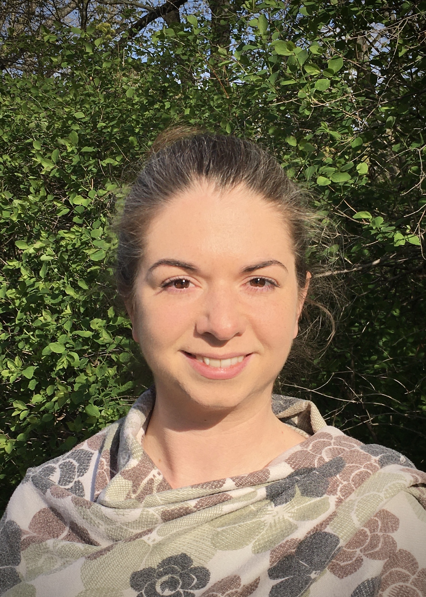

# Beatrice Hildebrandt
Data Engineer and Analyst

<a href="beatrice.hildebrandt@gmail.com">beatrice.hildebrandt@gmail.com</a>

<a href="https://froggibella.github.io/bea-cv/">Curriculum Vitae</a>

### Specialized in

Data Engineering, BI, Data Analytics, Reporting, and Data Warehousing (10 years experience)

### Profile

Outgoing and detail-oriented, highly motivated Data Expert with 10 years of experience in Business Intelligence, Analytics and Data Warehousing.
Proficient in creating dashboards 📈, ETL-processes ↪️, reports 📊 and ad-hoc analysis 📰.

### Interests

dancing 💃, childcare 👶, statistics 📈, cycling 🚴, music 🎹

## Skills

`**********`
Python (mainly Pandas), Pyspark, SQL

`*********`
Reporting Tools (Qlik, MSTR, DataStudio etc.)

`*********`
Git, Jira, ZenHub

`********`
Jupyter, Databricks, Airflow, S3

`******`
R, Stata, SPSS, FastAPI

`****`
JS, PHP, C

### Languages

`**********`
German

`*******`
English

`*****`
French

## Employment

`December 2025/January 2026`
__Moving to Freiburg__

`September 2022 - November 2025`
__Zalando Marketing Services GmbH, Berlin__

> Data Engineer

- implementation and optimization of backend services
- load testing and incident management
- automate tracking updates and create reporting for product teams
- Enhance data pipelines and algorithms for better campaign management
- Refactor ETL processes
- Improve data quality and system robustness by creating integrity checks
- Enabled better internal testing and validation by synthetic data generation for staging environments
- Contributed to the technical design, data modeling, and analysis for strategic projects such as Budget Recommendations and Article Performance Monitoring
- Collaborated with cross-functional teams to align technical implementation with business objectives

`June 2019 - August 2022`
__Zalando Marketing Services GmbH, Berlin__

> Data Analyst

- Create dashboards for brand partners
- Automate data-pipelines
- Process data and generate insights for various use cases
- Stakeholder-management
- Implement self-service data solutions

`June 2021 - December 2021`
__OMICRON electronics GmbH, Erlangen__

> Software Engineer

- Research on potential monitoring tools
- Create dashboard as part of a surveillance system to track and monitor alerts and potential cyber attacks in substations

`December 2018 - May 2019`
__data4life gGmbH, Berlin__

> Data Engineer

- Research, plan and set up Web tracking
- Build prototype data structure for storing medical records

`October 2017 - November 2018`
__tausendkind GmbH, Berlin__

> BI/DWH Developer

- Build and enhance rerports in QlikView/Metabase for inhouse usage
- Generate one-time analysis for decision makers
- Develop new and extend existing DWH structures in all ETL layers
- Administrate QlikView licences and report loads
- Manange JS pixel within Google TagManager

`June 2016 - September 2017`
__tausendkind GmbH, Berlin__

> Working student BI/DWH

- Forecast monetary key performance indicators
- Create adhoc analysis for marketing, logistics, finance and buyers
- Refactor main parts in DWH

`April 2013 - March 2014`
__Robert Bosch GmbH, Nuremberg__

> PreMaster Program

- Departments: HR, Logistics, Controlling

## Education

`October 2014 – September 2016`
__Computer Science__ 
__for Graduates in the Humanities or Social Science__

> Master of Science

Technical University, Chemnitz

Specialization: Database and web development

Masterthesis: Rolling forecast based on monetary key performance indicators in e-commerce business

Grade: 1.7

`April 2014 – September 2014`
__Statistics__

> Master of Science

Otto-von-Guericke University, Magdeburg

`October 2009 – June 2013`
__Sociology__

> Bachelor of Arts
 
Otto-Friedlich University, Bamberg

Specialization: Ergonomics, labour market, labour organization 

Grade: 2.2

## Details

📮 Bertha-von-Suttner-Str. 6,
79111 Freiburg,
Germany

☎️ +49 176 22 676 440

### Born

1990-03-21 in Kronach, Germany

### Nationality

German

